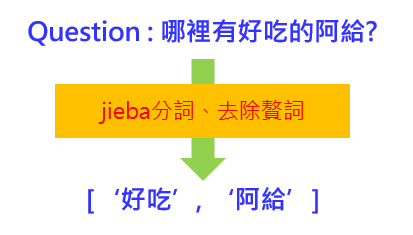
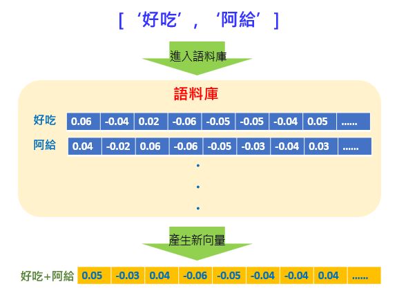
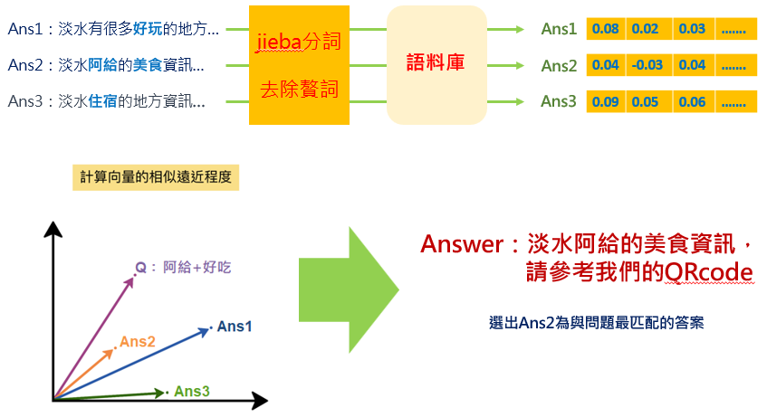

# Tourism and Sightseeing System 旅遊導覽系統
此為課程研習專題的作品，情境為淡水旅遊中心內建置的語音系統，當遊客詢問淡水地區相關問題時，系統會回覆對應的答案，此篇內容並不詳述code的寫法，主要著重在原理以及架構之上。

## 摘要
實現的方式是以 Raspberry 作為運算核心，透過麥克風收音，將音訊轉化為文字 (Speech to Text)，再藉由中文自然語言處理 (NLP) ，包含 Jieba 中文斷詞以及刪除停用詞等處理來提高文字的識別率，再以詞向量方式將句子轉成向量 (word2vector)。最後以兩兩間向量夾角的餘弦值，決定什麼樣的問題，應該要播報那一組答案 (Text to Speech)。

## 流程以及說明
* 語料庫的建立以及轉換向量

因為場景預設在淡水，所以語料的篩選上都是和淡水有關係的，例如好吃、阿給、紅毛城等，並去除不必要的贅詞；將這些詞彙套用到 word2vec 模型之中將每一個詞向量化，並建立像是向量資料庫的概念，如下圖示意：

* 語音轉文字、文字轉語音

一開始會透過收音裝置輸入問題，但是進入主程式前必須將語音轉換成文字，系統才能夠處理；而最後為了更貼近人性化，除了顯示答案外，還會透過語音將答案"說"出來。前面語音轉文字用到的是 "SpeechRecognizion" 的套件，後面文字轉語音則是用 "gTTS" 的套件，兩者都是 google 的服務。

* 將問題進行前處理

舉例我們的問題為："哪裡有好吃的阿給"，當語音輸入轉換為文字後，首先會先經過 "jeiba" 進行分詞，將原本的問句分成像是" 哪裡 / 有 / 好吃 / 的 / 阿給 "的斷詞，然後在去除贅詞以及不必要的語句，最後留下只剩" 好吃 / 阿給 "這兩個關鍵詞。

* 關鍵詞進入語料庫計算向量

剛剛上一步產生的" 好吃 / 阿給 "關鍵詞進入到語料庫，語料庫中如有" 好吃 "和" 阿給"的向量資料，此時會將此兩個向量重新計算出一組新的向量值

* 利用向量之間的角度找出最接近的答案

如同問題一樣，由於我們的答案是已經預設好的各種回答，每一種回答也是會經過前處理之後，產生各自的向量值，每一組向量值在 XY 平面上如下圖示意，經過計算後兩向量間角度最接近的會被選為該問題的答案

* 其他

最一開始有使用 OpenCV，可外接攝影機，如偵測到人臉接近時，會自動執行系統；介面是用 tkinter 製作

* 版本介紹

15: 最終版

16: 取消播放按鈕，進行收音無限循環。
17: 利用 speechReg 功能 收音不到太久 30 秒跳出主程式。
18: 利用 臉部偵測，偵測多次看不到人跳出主程式。
19: 利用 pyaudio 偵測收音 30秒沒有達標準，跳出主程式。
20: 利用 pyaduio 收音，搭配 google 音訊轉文字，達到同步效果。
    利用 pyaudio 偵測音量 30 秒內，沒有達標準，跳出主程式。