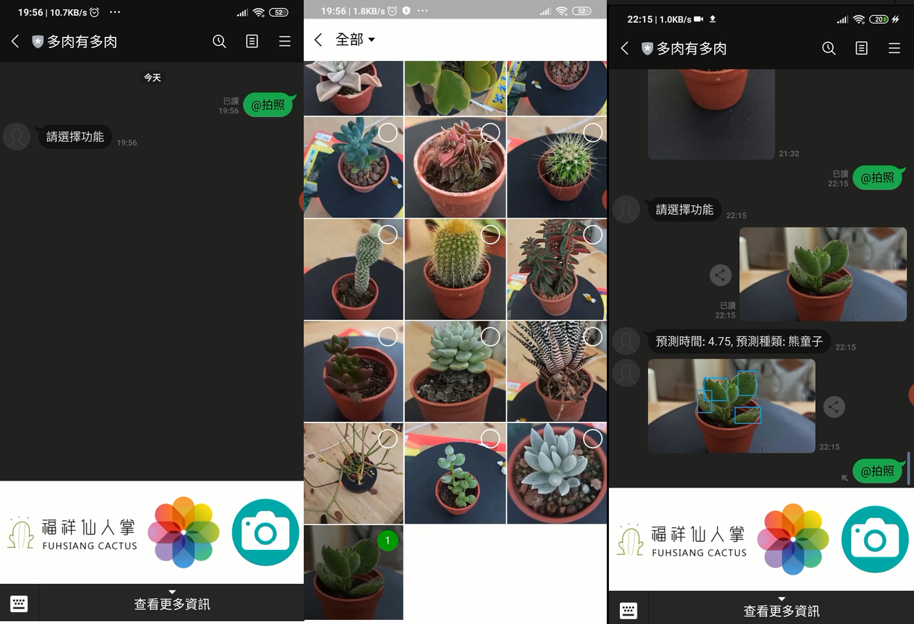
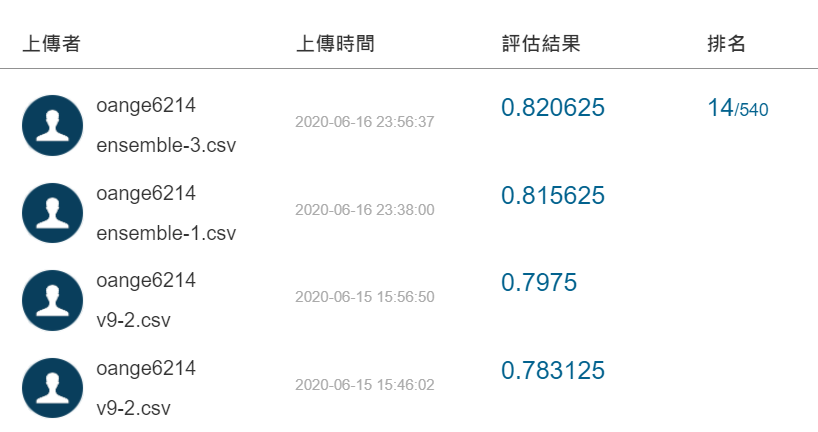
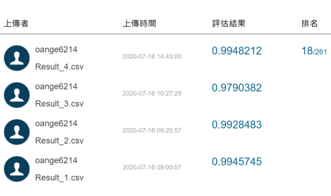
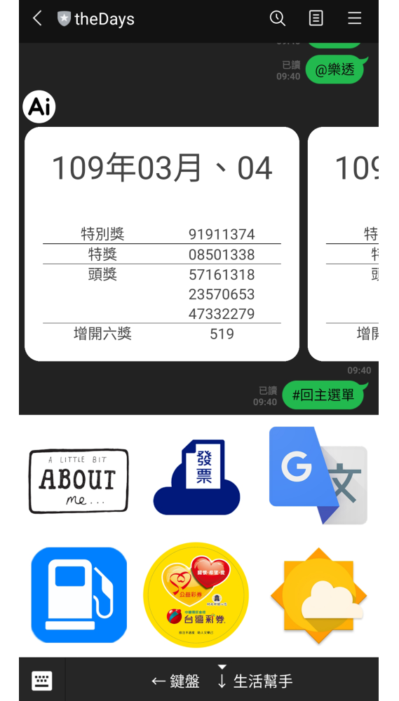

# Tibame_Projects

## [1]CV_Catus

專題係仙人掌辨識，訓練 20 種多肉植物，並強化模型的辨識正確率，找出各種影響辨識能力的原因。

從資料取得、資料預處理、模型建立、模型訓練、模型測試、演算法調優、參數調整、各種 CNN 模型方面研究如何改善正確率，並研究目標檢測框架 (YOLO v3、EfficientDet) 的原理與實踐，前端搭配 Line chatbot、後端使用 Azure + Heruku ClearDB。

## [2]CV_Aidea_Mango

賽會提供人工標註的芒果優劣等級（３類），並將資料分為訓練集、建構集（開發集）與測試集。競賽的主要目標為從大會提供之影像進行提取特徵併辨識所提供之標籤，並針對所擷取出來的特徵進行影像評估，確定等級。

## [3]CV_AOI

自動光學檢查，為高速高精度光學影像檢測系統，運用機器視覺做為檢測標準技術，可改良傳統上以人力使用光學儀器進行檢測的缺點。針對所提供的 AOI 影像資料，來判讀瑕疵的分類，藉以提升透過數據科學來加強 AOI 判讀之效能。

## [4]NLP_Bot_demo

專題係以淡水導覽為主軸，使用者可以藉由麥克風詢問機器人，淡水各種吃、喝、玩樂、景點、住宿、交通的資訊，都會藉由 Raspberry Pi 進行處理，利用模型判別使用者的意圖，將結果透過螢幕顯示。

## [5]Line_Bot_theDays
